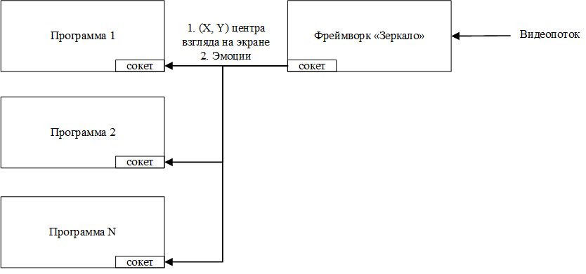
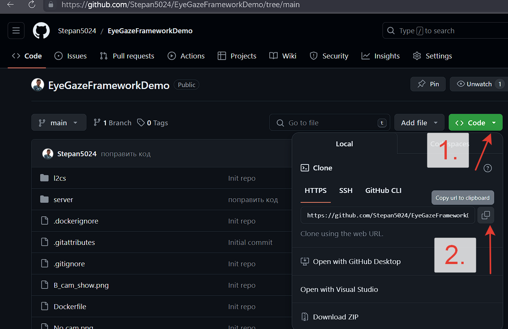
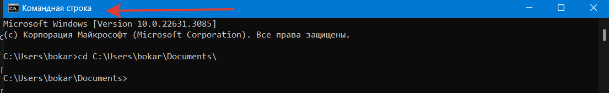

# Фреймворк Зеркало 

Содержание:
- [Описание](#Описание)
- [Функциональность](#Функциональность)
- [Запуск в Docker](#Запуск-в-Docker)
- [Запуск исходного кода](#Запуск-исходного-кода)
- [FAQ](#faq)

# Описание
Основная задача фреймворка – считывание видео потока с источника, выделение информативных признаков лица и передача сторонним программам компьютера информации о взгляде и эмоциях.
1.	Определение 2D направленного взгляда пользователя на экране монитора.
2.	Определение мимических эмоций.

Сценарий использования 1:
Общий случай работы сторонних десктопных программ на любых языках программирования с информацией об эмоциях, взгляде, передаваемой от фреймворка «Зеркало».

В данном примере на пользовательском устройстве запущен исполняемый файл фреймворка «Зеркало» и некоторое множество программ сторонних разработчиков на любых языках программирования. Фреймворк считывает видеопоток с камеры и на выдает через сокет соединение координаты (х, у) центра взгляда на экране и эмоции пользователя. Программы внешних разработчиков считаются клиентами, получающими информацию от фреймворка по средством установленного сокет соединения. Сторонние программы в данном случае получают центр взгляда для всего экрана и должны самостоятельно проверять находится ли программа активным окном, расположенным поверх других окон. 
# Функциональность
Разработаны и предоставлены библиотеки классов, следующих модулей:
1) Модуль установки зависимостей python и проверки оборудования 
2) Модуль чтения видеопотока с заданной частотой
3) Модуль поиска портрета человека и выделения информативных признаков  (области глаз, губ, щек, бровей)
4) Модуль сегментации радужки глаз, склеры, зрачка
5) Модуль определения по центру зрачка 3D вектора взгляда в пространстве 
6) Модуль определения наклона головы в пространстве
7) Модуль проецирования 3D взгляда с учетом наклона головы на 2D пространство монитора
8) Модуль определения мимики и эмоций
9) Модуль передачи входной и выходной информации через сокет-API

Представлена программа-клиент получающая информативные признаки через сокет соединение с фреймворком


# Запуск в Docker

Это руководство описывает, как собрать и запустить приложение фреймворка "Зеркало" внутри Docker контейнера на вашем локальном компьютере.

## Предварительные требования

Перед началом убедитесь, что на вашем компьютере установлен Docker. 
Например, запустите его кликнув по значку в меню Пуск Windows. Или скачайте docker-desktop по ссылке https://www.docker.com/products/docker-desktop/
Также вам потребуется X сервер для графического вывода, для чего мы рекомендуем использовать Xming для пользователей Windows.


## Сборка Docker образа (для Linux пользователей)

1) Запустите программу docker кликнув по значку в меню Пуск Windows. Или скачайте docker-desktop по ссылке https://www.docker.com/products/docker-desktop/

2) Скачайте исходный код проекта в рабочую папку

Зайдите на сайт github.com в репозиторий


Скопируйте команду или воспользуйтесь готовой:
```bash
git clone https://github.com/Stepan5024/EyeGazeFrameworkDemo.git
cd EyeGazeFrameworkDemo
```

3) Для сборки вашего Docker образа выполните следующую команду в терминале, где находится Dockerfile:

```bash
docker build -t gaze-tracking-server .
```
> Эта команда создает Docker образ с именем gaze-tracking-server, основанный на инструкциях подготовленного заранее Dockerfile.

### Решение проблемы с доступом к камере в Docker:
Чтобы разрешить Docker контейнеру доступ к видеокамере, необходимо использовать параметр --device при запуске контейнера. Это позволит пробросить устройство камеры внутрь контейнера.
дентификация устройства камеры:

Сначала убедитесь, какие видеоустройства доступны на вашем хосте. На Linux это можно сделать с помощью команды:

```
ls /dev | grep video
```
### Модификация команды запуска Docker:
Добавьте параметр --device к вашей команде запуска контейнера, чтобы предоставить доступ к видеокамере. Например, если ваше устройство называется /dev/video0:

```
docker run -p 9556:9556 --device /dev/video0:/dev/video0 gaze-tracking-server
```
4) Запустите сервер командой ниже
```
docker run -p 9556:9556 gaze-tracking-server
```
> Эта команды: 
> * docker run: основная команда для создания и запуска нового контейнера Docker.
> * -p 9556:9556: параметр -p используется для публикации порта. Это говорит Docker пробросить порт 9556 внутри контейнера на порт 9556 на хост-машине, делая сервис, который слушает порт 9556 внутри контейнера, доступным на том же порту на хосте. Формат -p хост:контейнер означает "пробросить порт из контейнера на хост".
> * gaze-tracking-server: это имя образа Docker, на основе которого будет создан контейнер. Docker сначала ищет этот образ локально на вашем компьютере, а если образ не найден, он попытается загрузить его из удаленного репозитория (по умолчанию из Docker Hub).


## Использование
Если вы столкнетесь с какими-либо проблемами обратитесь к Степану Бокареву -- он поможет.

Возможно Docker не получиться использовать, тогда перейдите к тому чтобы использовать исходный код. Инструкция по запуску исходного кода ниже
# Запуск исходного кода 

Эта инструкция поможет вам настроить и запустить Python-проект на вашем локальном компьютере.

## Предварительные требования

Убедитесь, что на вашем компьютере установлены следующие инструменты:

- Python 3.10 https://www.python.org/downloads/release/python-3100/
- pip (менеджер пакетов для Python)
- VS Code https://code.visualstudio.com/

## Установка

Следуйте этим шагам для настройки проекта:

### Шаг 1: Клонирование репозитория

Клонируйте репозиторий проекта с помощью git:
Зайдите на сайт github.com в репозиторий https://github.com/Stepan5024/EyeGazeFrameworkDemo


Выберите папку на компьютере, где хотите хранить проект. Например, 
C:\Users\bokar\Documents\

Откройте консоль (командную строку) CMD windows, перейдите в папку:
```bash
cd C:\Users\bokar\Documents\
```


Скачайте репозиторий командой git clone
```bash
git clone https://github.com/Stepan5024/EyeGazeFrameworkDemo.git
```
Перейдите в консоли в папку
```bash
cd EyeGazeFrameworkDemo
```

### Шаг 2: Создание виртуального окружения
Создайте виртуальное окружение для изоляции зависимостей проекта:

**Виртуальное окружение создавайте в папке скачанного проекта. Используйте команды cd в консоли чтобы перейти в нужную папку.**

Для пользователей Windows
```bash
python -m venv env
env\Scripts\activate
```

Для пользователей macOS и Linux
```
python3 -m venv env
source env/bin/activate
```

### Шаг 3: Установка зависимостей
Установите необходимые зависимости из файла requirements.txt:
```
pip install -r requirements.txt
```

## Запуск проекта
После установки всех зависимостей вы можете запустить проект следующими командами
1) Сервер:
```
python server.py
```
2) Клиент:
```
python client.py
```
### Шаг 4: Деактивация виртуального окружения
После завершения работы с проектом вы можете деактивировать виртуальное окружение:

```
deactivate
```
# Готовые исполняемые файлы
* Сервер доступен по ссылке [здесь](https://drive.google.com/drive/folders/1zEDqABiFeY6akxHLA7oif_UQ9StXd4Bq?usp=sharing "Сервер")

* Клиент доступен по ссылке [здесь](https://drive.google.com/drive/folders/15jvv_BmhaxGvx0_TDShWm4TZbOZhD3KF?usp=sharing "Поиск в интернете")
# Проблемы и решения
Если у вас возникнут проблемы с установкой или запуском проекта, пожалуйста, проверьте следующее:

* Убедитесь, что вы активировали виртуальное окружение перед установкой зависимостей. (env\Scripts\activate)
* Убедитесь, что используете версию Python 3.10

Если проблемы сохраняются, пожалуйста, создайте issue в репозитории проекта на GitHub или обратитесь к Степану Бокареву.

